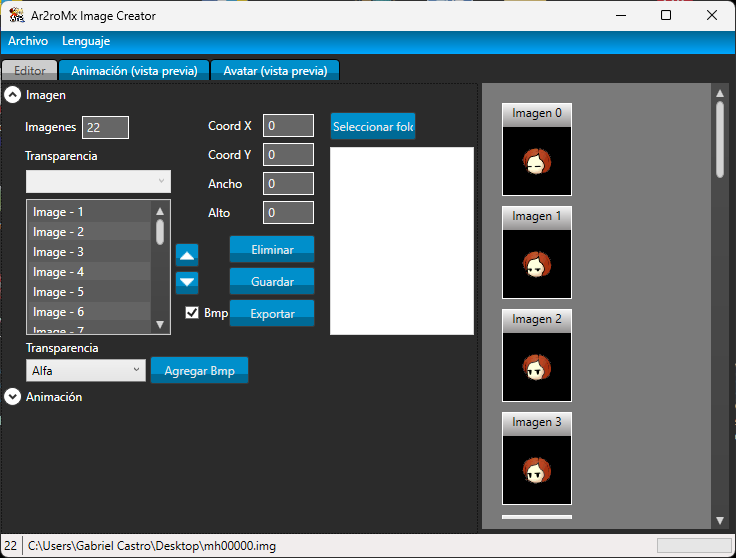
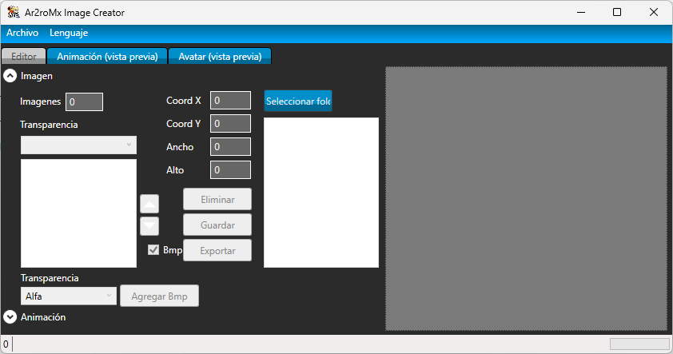

<h1  align="center">GunBound Image Creator</h1>

A simple C# Program to edit gunbound .img files
    

This program was built with ❤︎ by <a  href="https://github.com/zC4sTr0">Gabriel Castro</a>

# Preview

 
# Features

  

- IMG reader/extractor - Create your own avatar!
- Preview of the avatar in the program itself
- Supports all versions of GunBound WC1 (even the old ones)
- Supports many IMG formats (PNG, BMP, etc)
- Change avatar position frame by frame
- Create your custom avatars  

# How to run

You can run this program on our Release page or you can compile it yourself using Visual Studio 2019.
The program is very simple and it doesn't need any installation of third-party libraries.
This program was made using C# and .NET Framework 4.7.2 

# About me

  

<h3  align="center"> I'm Gabriel Castro and I love coding softwares!</h3>

I'm a Lifelong learner, software developer, I study economy, blockchains, tech, astronomy and history. Intelectually generalist, I have interests in many fields of science. 

###### I talk about Bitcoin, web3, and economy on my twitter:

    

- 🔭 I’m currently working on [GunBound GITZ](www.gitzwc.com) as Founder/CEO and in DavinTI - a software development company - as a Full Stack Developer since 2020

- 🌱 I’m currently studying **Solidity, Python and React Native**

- 👨‍💻 All of my projects are available at [www.github.com/zC4sTr0](www.github.com/zC4sTr0)

- 📫 How to reach me: **gabriel.sodre@aluno.ufop.edu.br**

<h3  align="left">Connect with me:</h3>

<h3  align="left">Languages and Tools:</h3>

                          

